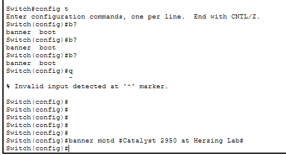
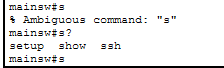
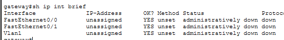
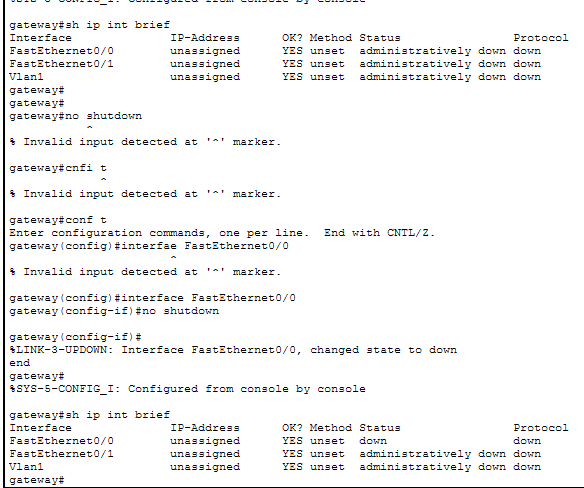
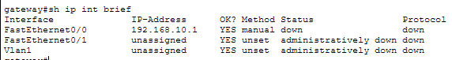
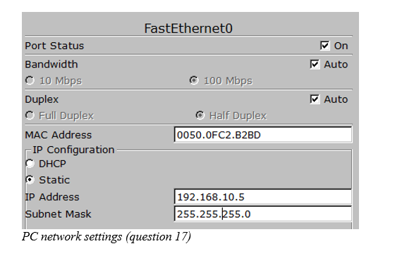
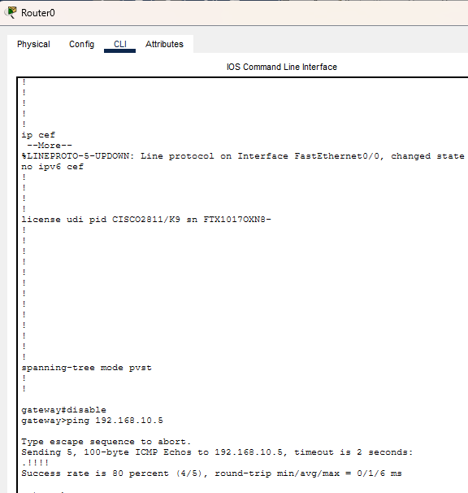
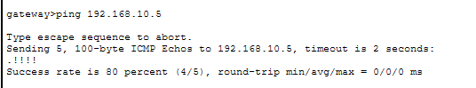

# Cisco Packet Tracer: Switch & Router Configuration

## Project Overview

This lab documents hands-on configuration of a Cisco Catalyst 2950T switch and a Cisco 2811 router using Cisco Packet Tracer and Cisco IOS CLI commands. The lab covers switch interface settings, IOS command modes, router interface configuration, IP addressing, DHCP, device security, cabling, and connectivity testing.

## Devices Used

- Cisco Catalyst 2950T Switch
- Cisco 2811 Router
- Desktop PC
- Cisco Packet Tracer

## Switch Configuration

The Cisco Catalyst 2950T has two Gigabit Ethernet interfaces. The first Fast Ethernet interface is `FastEthernet0/1` (`Fa0/1`).

The switch was accessed through the CLI. In User EXEC mode, the prompt appears as:

```text
Switch>
```

The `enable` command was used to enter Privileged EXEC mode:

```text
Switch#
```

A Fast Ethernet interface was changed to half duplex using the IOS command:

```text
duplex half
```

The switch hostname was changed to `mainsw` using:

```text
hostname mainsw
```

### MOTD Banner

The Message of the Day was configured with:

```text
banner motd #Catalyst 2950 at Herzing Lab#
```



### IOS Command Abbreviation and Help

The command history was viewed with:

```text
show history
```

and its abbreviated form:

```text
sh h
```

When the command was reduced to a single letter, IOS returned an ambiguous command message. Using `s?` showed the possible commands beginning with `s`: `setup`, `show`, and `ssh`.



## Router Configuration

A Cisco 2811 router was added and renamed to:

```text
gateway
```

The command:

```text
show ip interface brief
```

showed the following interfaces:

- `FastEthernet0/0`
- `FastEthernet0/1`
- `Vlan1`

Initially, all interfaces were administratively down.



### FastEthernet0/0 Activation

The interface was enabled using:

```text
no shutdown
```

After enabling it, the interface was no longer administratively down. It remained `down/down` until an active physical connection was present.



### FastEthernet0/0 IP Configuration

The interface was configured with:

```text
IP address: 192.168.10.1/24
Description: Internal
```

The IOS configuration commands were:

```text
interface FastEthernet0/0
ip address 192.168.10.1 255.255.255.0
description Internal
no shutdown
```

The new IP address was verified with `show ip interface brief`.



### FastEthernet0/1 DHCP Configuration

The second Fast Ethernet interface was configured to obtain an IP address through DHCP and was enabled with:

```text
interface FastEthernet0/1
ip address dhcp
no shutdown
```

## Device Security

Both `enable secret` and `enable password` were configured. The lab demonstrated that `enable secret` is stored more securely and takes precedence when both are configured.

## PC Configuration

The desktop PC was configured with:

```text
IP address: 192.168.10.5
Subnet mask: 255.255.255.0
```

The PC was connected directly to the router through `FastEthernet0/0`.



## Connectivity Test

From the router User EXEC mode, connectivity to the PC was tested with:

```text
ping 192.168.10.5
```

The observed result was:

```text
Success rate is 80 percent (4/5)
```

This confirmed communication between the Cisco 2811 router and the PC.



## Straight-Through Cable Test

The lab also tested replacing the cross-over cable with a straight-through cable. In this Packet Tracer simulation, the link remained active and the ping still succeeded.



## Skills Demonstrated

- Cisco IOS CLI navigation
- User EXEC and Privileged EXEC modes
- Global and interface configuration modes
- Cisco switch interface configuration
- Half-duplex configuration
- IOS command abbreviation and contextual help
- MOTD banner configuration
- Router hostname configuration
- IPv4 interface addressing
- DHCP interface configuration
- Interface descriptions
- `no shutdown` interface activation
- Router security configuration
- Ethernet cabling
- ICMP connectivity testing with `ping`
- Troubleshooting interface status and command syntax

## Lab Result

The switch and router were successfully configured through Cisco IOS CLI, the PC was placed on the `192.168.10.0/24` network, and end-to-end connectivity between the Cisco 2811 router and the PC was verified successfully.