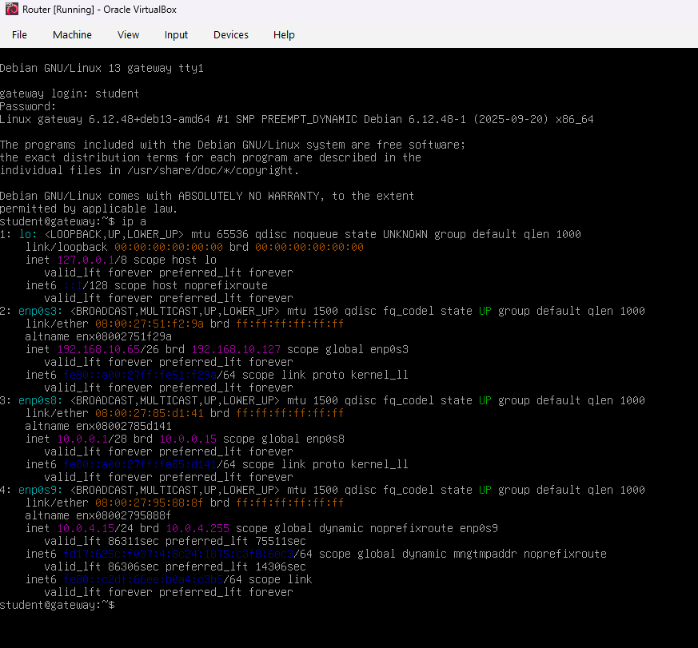
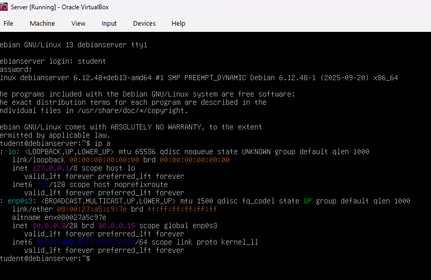
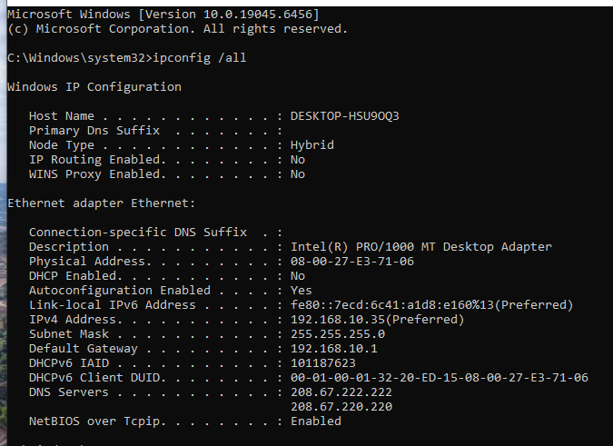
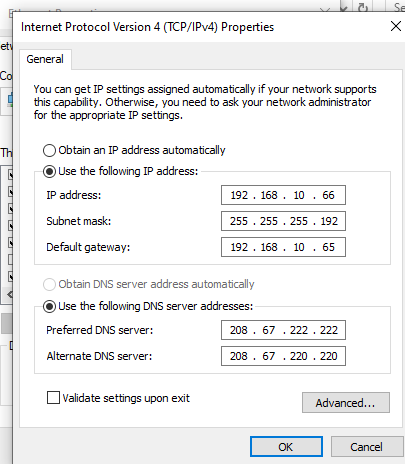
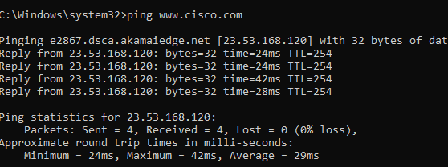

# Networking Subnetting & Routing Lab

## Project Overview

This project documents a hands-on virtual networking lab focused on subnetting, routing, IPv4 addressing, DNS, default gateway configuration, and connectivity troubleshooting. The lab used a router VM, a Linux server VM, and a Windows client VM. The main goal was to inspect the existing network, identify an addressing problem on the client, correct it, and verify successful Internet and DNS connectivity.

## Devices Used

- Router VM
- Linux Server VM
- Windows Client VM
- VirtualBox
- Windows and Linux networking tools

## Skills Demonstrated

- IPv4 addressing
- CIDR (Classless Inter-Domain Routing) notation
- Subnet masks and subnetting
- Network and broadcast address identification
- Default gateway configuration
- DNS (Domain Name System) configuration
- Linux network interface inspection with `ip a`
- Windows network troubleshooting with `ipconfig`
- Connectivity testing with `ping`
- Basic routing and DMZ (Demilitarized Zone) network planning

## Lab Topology

The lab contains three main systems:

- **Router VM**
- **Linux Server VM**
- **Windows Client VM**

## Router Configuration

The router interfaces were inspected using:

```bash
ip a
```

Observed interfaces:

| Interface | IP Address | CIDR | Network |
|---|---:|---:|---:|
| `enp0s3` | `192.168.10.65` | `/26` | `192.168.10.64/26` |
| `enp0s8` | `10.0.0.1` | `/28` | `10.0.0.0/28` |
| `enp0s9` | `10.0.4.15` | `/24` | `10.0.4.0/24` |

The `enp0s3` interface connects to the Windows client network, while `enp0s8` is on the same network segment as the server.

### Router Interface Verification



## Server Configuration

The Linux server was inspected using:

```bash
ip a
```

Observed server configuration:

- **Interface:** `enp0s3`
- **IP address:** `10.0.0.3/28`
- **Network:** `10.0.0.0/28`
- **Broadcast:** `10.0.0.15`

The router interface `10.0.0.1/28` and the server `10.0.0.3/28` are on the same network segment.

### Server Interface Verification



## Windows Client Troubleshooting

The Windows client initially had incorrect IPv4 settings.

### Original Configuration

- IP address: `192.168.10.35`
- Subnet mask: `255.255.255.0`
- Default gateway: `192.168.10.1`
- Preferred DNS: `208.67.222.222`
- Alternate DNS: `208.67.220.220`

The router interface connected to the client network was `192.168.10.65/26`, so the Windows client was not configured for the correct subnet.

### Original Windows Client Settings



### Corrected Configuration

The client configuration was changed to:

- **IP address:** `192.168.10.66`
- **Subnet mask:** `255.255.255.192`
- **Default gateway:** `192.168.10.65`

The DNS settings remained unchanged:

- Preferred DNS: `208.67.222.222`
- Alternate DNS: `208.67.220.220`

### Corrected Windows Client Settings



## Why `/26` Was Required

A `/26` prefix corresponds to the subnet mask:

```text
255.255.255.192
```

The subnet containing the router interface `192.168.10.65/26` is:

```text
Network:   192.168.10.64/26
Hosts:     192.168.10.65 - 192.168.10.126
Broadcast: 192.168.10.127
```

Therefore, `192.168.10.66` is a valid client address on the same subnet as the router interface `192.168.10.65`.

## Connectivity Verification

After correcting the Windows client settings, Internet connectivity and DNS resolution were tested.

### Website Test

The client successfully accessed the Herzing College website, confirming that Internet connectivity was restored.


### DNS and Ping Test

The following command was used:

```cmd
ping www.cisco.com
```

The test completed successfully with no packet loss, confirming both Internet connectivity and successful DNS name resolution.



## Adding Another Server to the DMZ Segment

The existing server network is:

```text
10.0.0.0/28
```

Important addresses:

- Network address: `10.0.0.0`
- Router / default gateway: `10.0.0.1`
- Existing server: `10.0.0.3`
- Broadcast address: `10.0.0.15`

A possible IP address for another server is:

```text
10.0.0.2
```

assuming that address is not already in use.

The `/28` subnet mask in full notation is:

```text
255.255.255.240
```

The default gateway for the new server would be:

```text
10.0.0.1
```

## Subnetting Review

### Useful Formulas

**Usable hosts:**

```text
2^(host bits) - 2
```

**Host bits:**

```text
32 - CIDR prefix
```

**Block size:**

```text
256 - interesting mask octet
```

### Quick Reference

| CIDR | Subnet Mask | Block Size | Usable Hosts |
|---:|---|---:|---:|
| `/25` | `255.255.255.128` | 128 | 126 |
| `/26` | `255.255.255.192` | 64 | 62 |
| `/27` | `255.255.255.224` | 32 | 30 |
| `/28` | `255.255.255.240` | 16 | 14 |
| `/29` | `255.255.255.248` | 8 | 6 |
| `/30` | `255.255.255.252` | 4 | 2 |

### `/20` Example

A `/20` subnet mask is:

```text
255.255.240.0
```

Binary form:

```text
11111111.11111111.11110000.00000000
```

## Key Lessons Learned

- Devices must be configured for the correct subnet to communicate through the intended network design.
- A correct IP address alone is not enough; the subnet mask must also match the network.
- The default gateway must point to the router interface on the local subnet.
- DNS problems and routing problems can appear similar, so testing by both IP address and hostname helps isolate the issue.
- `ip a`, `ipconfig`, and `ping` are simple but powerful troubleshooting tools.
- Understanding CIDR notation makes subnet ranges, usable hosts, and broadcast calculations much easier.

## Lab Result

The Windows client network configuration was successfully corrected from the wrong subnet settings to `192.168.10.66/26` with the default gateway `192.168.10.65`. After the correction, website access and `ping www.cisco.com` both worked successfully, confirming that routing, Internet connectivity, and DNS resolution were functioning correctly.
